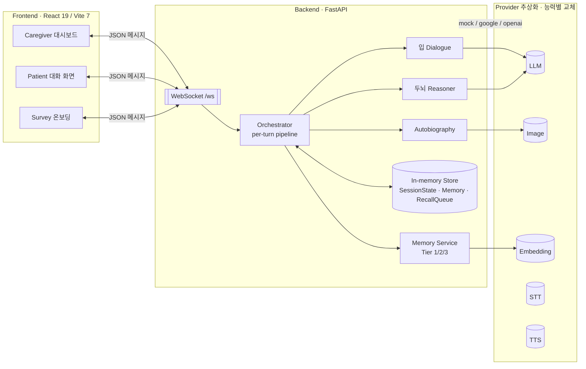
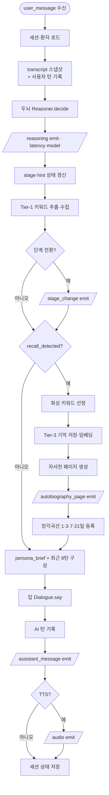
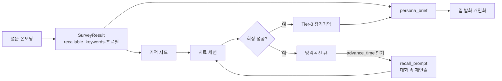
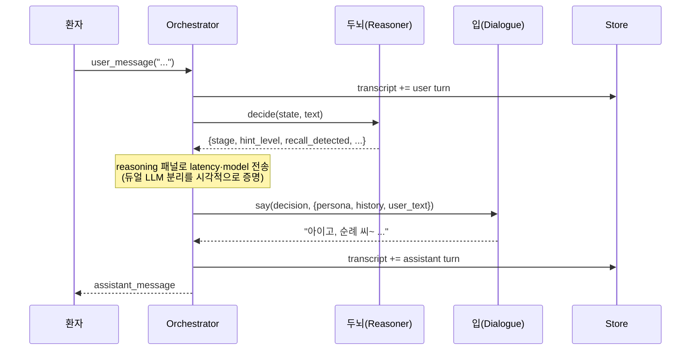
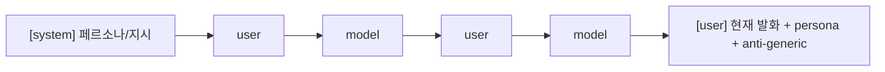
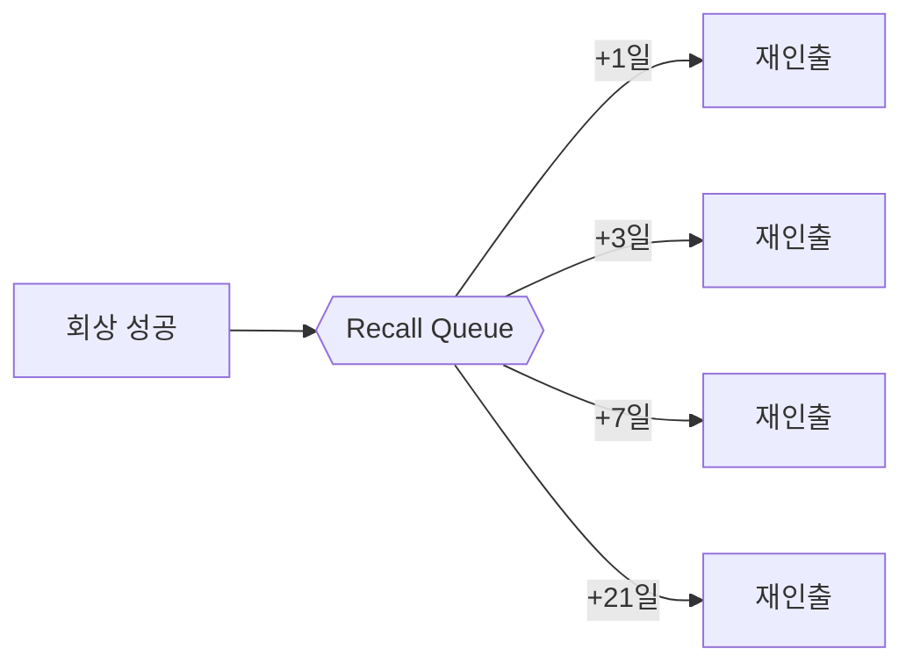

# Memory Rhythm (메모리 리듬) — 기술 보고서

> 치매 어르신을 위한 **대화형 AI 동반자** — 회상치료(reminiscence therapy)와
> 망각곡선(forgetting curve)을 결합한 웹 데모.
> FastAPI · WebSocket · 듀얼 LLM(Google Gemini) · React 19.

---

## 1. 개요 (Executive Summary)

**Memory Rhythm**은 치매 어르신과 **오랜 친구처럼 대화**하며, 그 대화 속에서 자연스럽게
**기억 인출(recall) 훈련**을 수행하고, **망각곡선 주기(1·3·7·21일)**에 맞춰 같은 기억을
다시 떠올리게 하는 AI 동반자입니다. 회상에 성공한 이야기는 그림과 글이 있는
**자서전 페이지**로 축적됩니다.

핵심 설계 원칙은 세 가지입니다.

| 원칙 | 구현 |
|------|------|
| **사람처럼 대화** | 두뇌(추론)/입(발화)를 분리한 **듀얼 LLM**, 환자별 **데이터 기반 페르소나**, **대화 연속성** |
| **임상적 구조** | 3단계 치료 프로토콜(정서안정화 → 대화형인출 → 행동수행) + 망각곡선 재인출 |
| **즉시 실행 가능** | 비밀키 0개로 부팅되는 **mock 기본값**, 능력별 provider 교체(mock/openai/google) |

---

## 2. 문제와 접근 (Problem & Approach)

치매 환자에게는 **반복적·정서적으로 안전한 기억 자극**이 중요하지만, 일반 챗봇은
(1) 환자 개인의 삶을 모르고, (2) 매 발화가 단절되어 대화가 이어지지 않으며,
(3) 임상 프로토콜(점진적 단서 제공, 회상 주기 관리)을 따르지 않습니다.

Memory Rhythm은 이를 **세 층의 AI 설계**로 해결합니다.

```
정서적 안전(따뜻한 친구 톤)  →  개인화(환자의 실제 기억)  →  임상 구조(단계·망각곡선)
```

---

## 3. 시스템 아키텍처 (Architecture)



**메시지 흐름(한 턴):** 클라이언트의 `user_message` 하나가 들어오면 Orchestrator가
정해진 순서로 서버 이벤트를 emit 합니다.

```
reasoning → [stage_change] → [autobiography_page] → assistant_message → [audio]
```

### 3.1 처리 파이프라인 (Per-turn Pipeline)

`Orchestrator.handle_user_message()`는 환자 발화 한 건을 아래 파이프라인으로 처리하며,
각 지점에서 서버 이벤트를 순서대로 emit 합니다. **회상 분기(7–9)는 조건부**입니다.



| # | 단계 | 핵심 코드 | emit |
|:--:|------|-----------|------|
| 1 | 세션·환자 로드 | `get_or_create_session_state` · `ensure_demo_patient` | — |
| 2 | 히스토리 스냅샷 + 사용자 턴 기록 | `transcript` / `user_texts` append | — |
| 3 | **두뇌 추론** | `Reasoner.decide` → `ReasoningDecision` | `reasoning` |
| 4 | 상태 머신 갱신 | `stage` · `hint_level` · `stage2_turns` | — |
| 5 | Tier-1 키워드 수집 | `MemoryService.extract_keywords` | — |
| 6 | 단계 전환 | `state.stage = next_stage` | `stage_change` |
| 7 | *회상 시* 기억 저장 | `_record_recall` → Tier-3 임베딩 | — |
| 8 | *회상 시* 자서전 | `AutobiographyService.build_page` | `autobiography_page` |
| 9 | *회상 시* 망각곡선 등록 | `add_recall_items(1·3·7·21)` | — |
| 10 | **발화 생성** | `persona_brief` + history → `Dialogue.say` | `assistant_message` |
| 11 | *선택* 음성 합성 | `TTS.synthesize`(비어 있으면 생략) | `audio` |
| 12 | 세션 상태 저장 | `set_session_state` | — |

- 회상 분기(7–9)는 `recall_detected`일 때만 실행 → 기억 영속화·자서전·망각곡선이 한꺼번에.
- 입(10)은 **항상 두뇌의 결정 + 페르소나 + 최근 8턴**을 입력으로 받음 → 연속성·개인화가
  한 지점에 수렴.

### 3.2 데이터 · 인출 라이프사이클 (Data Pipeline)

한 턴을 넘어, 데이터가 어떻게 쌓이고 **다시 인출**되는지의 전체 수명주기입니다.



> 설문이 만든 `recallable_keywords`는 **§6.3 개인화 인출의 표적**이 될 데이터이며,
> 회상에 성공한 기억은 다시 `persona_brief`로 환류되어 친구가 환자를 점점 더 잘 알게 됩니다.

---

## 4. 핵심 설계 ① — 듀얼 LLM (두뇌 / 입)

추론과 발화를 **두 개의 LLM 역할로 분리**한 것이 이 시스템의 중심 아이디어입니다.

| 역할 | 책임 | 출력 |
|------|------|------|
| **두뇌 (Reasoner)** | 단계 전환, 힌트 수위(0→4) 결정, **회상 성공 판정** | `ReasoningDecision` JSON |
| **입 (Dialogue)** | 결정을 **따뜻한 한국어 한두 문장**으로 표현 | 환자에게 보일 발화 |



- 두뇌의 무거운 추론이 **입의 응답 지연을 막지 않도록** 분리.
- 프런트의 *reasoning-chain* 패널이 `latency_ms`와 `model`을 그대로 노출 →
  데모에서 **실제로 두 모델이 협업함**을 보여줌.
- 모델: **Google Gemini `gemini-2.5-flash-lite`** (두뇌·입 공용). 키가 없거나
  rate-limit(429)이면 **자동으로 mock** 으로 강등되어 데모가 멈추지 않음.

---

## 5. 핵심 설계 ② — 3단계 치료 프로토콜

| 단계 | 이름 | 역할 |
|:---:|------|------|
| **1** | 정서 안정화 | 따뜻한 priming, 라포 형성 |
| **2** | 대화형 인출 | **힌트 0→4 점진 제공**으로 회상 유도, 회상 성공 판정 |
| **3** | 행동 수행 | 회상한 기억을 **자서전 페이지**(그림+서사)로 정착 |

**Stage 2 인출 단서 사다리(hint escalation):**

```
0 열린 질문 → 1 카테고리 단서 → 2 주변 기억(소리·냄새·사람) → 3 시각 장면 → 4 직접 단서
```

환자가 머뭇거리면(`모르겠어`, `글쎄…` 등) 두뇌가 수위를 한 단계 올리고, 구체적인
기억 키워드가 나오면 `recall_detected=true` 로 판정해 Stage 3으로 넘어갑니다.

---

## 6. 핵심 설계 ③ — 대화 경험 (Conversation Design)

### 6.1 데이터 기반 페르소나 (per-patient persona) ✅
설문에서 쌓인 환자별 데이터로 `persona_brief`를 만들어 입(Dialogue)에 주입합니다.

```
성함 · 프로필 · 또렷이 기억하시는 것(키워드) · 아직 흐릿한 주제(억지로 캐묻지 말 것)
· 함께 떠올린 추억(누적 회상)
```

- 톤: 의사·상담사·기계가 아닌 **“오랜 친구”** (해요체, 공감·맞장구).
- **환각 방지:** “위에 없는 사실은 절대 지어내지 마세요” — 실제 기억만 사용.
- DB가 쌓일수록 친구가 환자를 **더 잘 알게** 됨.

### 6.2 대화 연속성 (chatbot continuity) ✅ *신규*
`SessionState.transcript`에 **사용자+AI 양쪽 턴**을 시간순 누적하고, 입(Dialogue)이
최근 **8턴**을 `messages` 배열로 재생해 진짜 챗봇처럼 맥락을 이어갑니다.



- 보호 지시(페르소나·일반질문금지)는 **마지막 user 메시지**에 유지 → 오래된 히스토리에
  희석되지 않음.
- Gemini `contents` 규약(‘user로 시작·교대’)을 구조적으로 보장(빈 턴 필터링 포함).

> **실측 검증:** 환자가 1턴에 “손자 **민수**”, 2턴에 “**케이크**”를 언급(둘 다 페르소나에
> 없음). 3턴에서 친구가 *“민수가 케이크 사다 줬을 때, 어떤 케이크였는지 기억나세요?”* 로
> **두 정보를 모두 기억**하고, 자연스럽게 **회상 질문**까지 시작 → 연속성 + 인출이 한
> 대화에서 함께 작동함을 확인.

### 6.3 대화 속 개인화 인출 테스트 🚧 *다음 마일스톤*
**현재:** 회상 성공 판정이 데모 시나리오 키워드(`시장/장터/학교…`)에 **하드코딩**되어
있어, 환자의 *실제* 기억(예: 나물·딸)은 회상으로 인식되지 않습니다.

**설계(구현 예정):** 환자의 `recall_anchors`(설문 `recallable_keywords` + 이미 회상한
기억의 키워드)를 두뇌에 주입해, **그 사람의 진짜 기억을 표적**으로 회상을 판정·유도.
시장 baseline은 설문 없는 데모 환자용 폴백으로 유지. *(상세 §12 로드맵)*

---

## 7. 메모리 시스템 & 망각곡선

| 계층 | 역할 | 구현 |
|:---:|------|------|
| **Tier-1** | 발화에서 키워드 즉시 추출 | 한국어 stop-word/조사 처리 경량 추출 |
| **Tier-2** | 세션 요약 | Stage-3 마감 요약(placeholder) |
| **Tier-3** | 장기 기억 영속화 | 임베딩 + 코사인 유사도 검색 |

**망각곡선 재인출:** 회상 성공 시 `RECALL_INTERVALS = (1, 3, 7, 21)` 일 간격으로
recall 아이템을 큐에 등록. 시뮬레이션 시계(`advance_time`)가 진행되면 만기된 항목이
`recall_prompt`로 **대화 속에 다시 등장**해 같은 기억을 재테스트합니다.



---

## 8. Provider 추상화 (zero-secrets)

능력별로 백엔드를 독립 교체할 수 있습니다 — `LLM / STT / TTS / IMAGE / EMBEDDING`,
값은 `mock | openai | google`.

- **기본값 mock:** API 키·DB 없이 즉시 부팅(오프라인 데모).
- **혼합 구성 가능:** 예) LLM·Image·Embedding = Google, TTS = mock.
- **우아한 강등:** 키 누락/429/안전차단 시 해당 능력만 mock으로 폴백 → 전체 중단 없음.
- 제출용 **국산 AI 교체**도 같은 인터페이스로 대응 가능.

---

## 9. 기술 스택

| 영역 | 스택 |
|------|------|
| **Backend** | Python 3.12, FastAPI, Uvicorn, **WebSocket**, Pydantic v2, `google-genai` |
| **Frontend** | React 19, Vite 7, Tailwind v4, shadcn/ui, wouter(router), framer-motion, TanStack Query |
| **AI** | Google Gemini `gemini-2.5-flash-lite`(두뇌·입), 임베딩/이미지(Google), mock 폴백 |
| **실행 환경** | conda(`memory-rhythm`), 프런트 `:5173` / 백엔드 `:8000` |

---

## 10. WebSocket 프로토콜 (계약)

프런트 `protocol.ts`와 백엔드 `schemas.py`가 **필드 단위로 동일**(discriminated union).

**Client → Server**

| type | 의미 |
|------|------|
| `start_session` | 세션·환자 바인딩 |
| `user_message` | 환자 발화 |
| `advance_time` | 시뮬레이션 시계 진행(망각곡선 발화) |
| `toggle_tone` | 40Hz priming 톤 on/off |

**Server → Client**

| type | 의미 |
|------|------|
| `reasoning` | 두뇌 결정 + `latency_ms` + `model` (듀얼 LLM 증명 패널) |
| `stage_change` | 단계 전환 |
| `assistant_message` | 입의 발화 |
| `autobiography_page` | 회상→그림책 페이지 |
| `recall_prompt` | 망각곡선 재인출 |
| `audio` | (선택) TTS mp3 |
| `error` | 오류 |

> 설문(onboarding)은 **별도 WS 엔드포인트**(`/ws/survey`)와 별도 메시지 유니언을 사용 —
> 대화형 온보딩으로 `SurveyResult`(프로필·`recallable_keywords`·요약)를 만들고 기억을
> 시드합니다.

---

## 11. 엔지니어링 / 회복탄력성 노트

실제 통합 과정에서 해결한 비자명한 문제들 — 데모 안정성의 핵심.

- **연결 회복:** WS **자동 재연결**(1.5s) + 세션 재바인딩 + 전송 가드 + **25s 워치독**으로
  “무한 대기”를 제거.
- **Gemini thinking 토큰:** `gemini-2.5-flash`는 thinking 모델 → 추론 토큰이
  `max_output_tokens`를 잠식해 요약이 잘림. `ThinkingConfig(thinking_budget=0)`로 해결.
- **MAX_TOKENS 안전 추출:** `resp.text`가 `MAX_TOKENS/SAFETY`에서 예외를 던지는 문제를
  `_response_text()`(parts에서 부분 텍스트 회수)로 보완 → 조용한 mock 폴백 버그 제거.
- **무료 등급 쿼터:** `gemini-2.5-flash` 무료 일일 한도가 매우 낮아(≈20) 429 발생 →
  쿼터는 **모델별 분리**이므로 **`gemini-2.5-flash-lite`**(더 높은 무료 한도, thinking 지원)로
  전환해 해소.
- **역할 매핑:** `_split_messages`가 `assistant→model`, system→`system_instruction`으로
  매핑 → 멀티턴 히스토리가 그대로 Gemini로 전달(연속성의 토대).

---

## 12. 현재 상태 & 로드맵

### 완료 ✅
- 프런트–백엔드 **풀 통합**, 폴더 정리, 통합 코드 리팩터링
- **듀얼 LLM** 추론/발화 분리 + reasoning 패널
- **3단계 프로토콜** + 힌트 사다리 + 자서전 페이지
- **데이터 기반 페르소나**(오랜 친구, 환각 방지)
- **대화 연속성**(transcript 8턴 재생) — *실측 검증 완료*
- 설문 온보딩, 망각곡선 스케줄링, Tier 1/2/3 메모리
- Provider 추상화(zero-secrets) + 우아한 폴백
- 연결 회복탄력성(재연결·워치독·가드)

### 다음 마일스톤 🚧
1. **개인화 인출 표적**(`recall_anchors`): 두뇌의 회상 판정을 환자의 *실제* 설문 키워드로
   전환(현재 ‘시장’ baseline 하드코딩). — *설계 확정, 구현 대기.*
   - `SessionState.recall_anchors` 추가 → `MemoryService.recall_anchors(patient_id)`
     (설문 `recallable_keywords` + 회상된 기억 키워드) → 두뇌 판정/힌트 유도에 주입,
     `_pick_recall_keyword` 우선순위 변경. 시장 baseline은 폴백 유지.
2. 망각곡선 재인출 문구의 개인 기억 연결 강화.
3. 제출용 **국산 AI** provider 스왑.

---

## 부록 — 주요 파일 지도

| 파일 | 책임 |
|------|------|
| `backend/app/services/orchestrator.py` | 한 턴 파이프라인(이벤트 emit 순서) |
| `backend/app/services/reasoner.py` | 두뇌 — 단계·힌트·회상 판정 |
| `backend/app/services/dialogue.py` | 입 — 페르소나·연속성·발화 생성 |
| `backend/app/services/memory.py` | Tier 1/2/3, `persona_brief` |
| `backend/app/services/survey.py` | 대화형 설문 → `SurveyResult` |
| `backend/app/services/autobiography.py` | 회상 → 그림책 페이지 |
| `backend/app/store.py` | 세션 상태·메모리·망각곡선 큐 |
| `backend/app/providers/google_provider.py` | Gemini LLM/Image/Embedding + 폴백 |
| `backend/app/config.py` | 능력별 provider·모델 해석 |
| `backend/app/schemas.py` | WS/REST 계약(단일 진실원) |
| `frontend/src/pages/Patient.tsx` | 환자 대화 UI(채팅·자서전 패널) |
| `frontend/src/lib/ws.ts` | WS 클라이언트(자동 재연결) |

---

*문서 생성: Memory Rhythm 통합/리팩터링 작업 기준. 상태 표기(✅ 완료 / 🚧 진행)는 현재
코드 트리(import 정상)를 그대로 반영함.*
